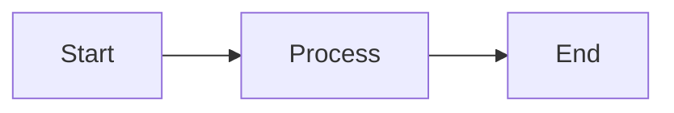

# WanForge Markdown Renderer

**Professional Markdown Renderer untuk Dokumen Kantor**

Renderer markdown dengan fitur lengkap, tema profesional Navy & Amber, dan support untuk semua format markdown modern termasuk Mermaid, KaTeX, dan syntax highlighting.

---

## Fitur Utama

### Markdown & Format
- **GFM Lengkap** - Tabel, task list, autolink, highlight
- **Extended Syntax** - Footnotes, definition list, mark, sub, sup
- **Task List** - Checklist dengan checkbox interaktif
- **Table Support** - Tabel dengan alignment dan styling profesional

### Code & Syntax
- **Syntax Highlighting** - Highlight.js dengan 200+ bahasa pemrograman
- **Copy Button** - Tombol copy otomatis di setiap code block
- **Code Fencing** - Support untuk semua format code fence

### Diagram & Visualisasi
- **Mermaid Diagram** - Flowchart, sequence, class, state, git, dan lainnya
- **Live Rendering** - Render diagram secara real-time
- **Responsive** - Diagram otomatis resize sesuai layar

### Matematika & Rumus
- **KaTeX Math** - Rendering rumus matematika profesional
- **Inline Math** - `$E = mc^2$`
- **Block Math** - `$$\\int x^2 dx$$`
- **Multiple Delimiters** - Support `$...$`, `$$...$$`, `\(...\)`, `\[...\]`

### Tema & User Interface
- **Professional Navy & Amber** - Palet warna profesional untuk kantor
- **Dark Mode** - Tema gelap dengan kontras sempurna
- **Responsive Design** - Bekerja sempurna di desktop, tablet, mobile
- **Live Preview** - Preview real-time saat mengetik
- **Table of Contents** - Daftar isi otomatis dari heading

### File Management
- **Open File** - Buka file `.md` langsung dari browser
- **Export HTML** - Export hasil ke file HTML standalone
- **Print/PDF** - Cetak atau simpan sebagai PDF
- **Local Storage** - Simpan otomatis ke browser storage

### Security & Performance
- **HTML Sanitization** - Menggunakan DOMPurify untuk keamanan
- **Debounced Rendering** - Performa optimal untuk dokumen besar
- **Error Handling** - Graceful error handling untuk rendering

---

## Quick Start

### Cara Menjalankan

#### Option 1: Buka Langsung di Browser
```bash
open index.html
```

#### Option 2: Server Statis (Recommended)
```bash
# Jalankan Python built-in server
python3 -m http.server 4173

# Atau gunakan Node.js http-server
npx http-server -p 4173
```

Buka di browser: http://localhost:4173

---

## Contoh Penggunaan

### Markdown Dasar
```markdown
# Heading 1
## Heading 2

**Bold** dan *italic*

- List item 1
- List item 2
  - Nested item

1. Numbered
2. Items
```

### Code dengan Syntax Highlighting
```js
function greet(name) {
  return `Hello, ${name}!`;
}
```

### Diagram Mermaid


### Rumus Matematika
```
Inline: $E = mc^2$

Block:
$$
\\int_0^\\infty e^{-x^2} dx = \\frac{\\sqrt{\\pi}}{2}
$$
```

### Footnotes
Teks dengan referensi.[^1]

[^1]: Ini adalah footnote.

---

## Struktur Proyek

```
markdown-live/
├── index.html          HTML utama + UI layout
├── app.js              JavaScript application logic
├── styles.css          Styling profesional Navy & Amber
└── README.md           Dokumentasi ini
```

### Dependencies (CDN-based)
- **markdown-it** v14 - Core Markdown parser
- **markdown-it-anchor** - Anchor generation
- **markdown-it-task-lists** - Task list support
- **markdown-it-footnote** - Footnotes
- **markdown-it-deflist** - Definition lists
- **markdown-it-mark** - Mark (highlight) text
- **markdown-it-sub** - Subscript
- **markdown-it-sup** - Superscript
- **highlight.js** v11 - Code syntax highlighting
- **katex** v0.16 - Math rendering
- **mermaid** v11 - Diagram rendering
- **dompurify** v3 - HTML sanitization

---

## Browser Support

| Browser | Support | Notes |
|---------|---------|-------|
| Chrome | Ya | Full support |
| Firefox | Ya | Full support |
| Safari | Ya | Full support |
| Edge | Ya | Full support |
| IE 11 | Tidak | Not supported |

---

## Tema & Warna

### Light Mode (Default)
```css
--primary: #001a4d;        /* Navy Blue */
--accent: #f59e0b;         /* Amber */
--bg: #f8fafc;             /* Almost white */
--panel: #ffffff;          /* Pure white */
```

### Dark Mode
```css
--primary: #e6f0ff;        /* Light navy */
--accent: #fbbf24;         /* Bright amber */
--bg: #0f172a;             /* Deep navy */
--panel: #1e3a5f;          /* Navy panel */
```

---

## Keyboard Shortcuts

| Action | Shortcut |
|--------|----------|
| Print/PDF | Ctrl+P (or Cmd+P) |

---

## Tips & Tricks

### Auto-save
Konten Anda secara otomatis tersimpan ke browser local storage. Akan di-restore saat halaman direload.

### Toggle Tema
Klik tombol "Tema" untuk mengganti antara light dan dark mode. Preferensi tersimpan otomatis.

### Copy Code
Setiap code block memiliki tombol "Copy" di pojok kanan atas. Klik untuk copy ke clipboard.

### Export
Gunakan tombol "Export" untuk download hasil render sebagai file HTML standalone atau gunakan Print untuk PDF.

---

## Troubleshooting

### Mermaid tidak render
- Periksa syntax Mermaid, harus valid
- Lihat browser console untuk error messages
- Coba refresh halaman

### KaTeX formula tidak tampil
- Pastikan delimiters benar: `$...$` atau `$$...$$`
- Cek syntax formula matematika
- Buka browser console untuk melihat error

### CDN tidak load
- Pastikan koneksi internet aktif
- Jika buka file langsung, gunakan server statis
- Cek browser security policies

---

## Copyright & License

© 2024-2026 **WanForge** | [wanforge.asia](https://wanforge.asia)

Professional Markdown Renderer untuk Dokumentasi Kantor

---

## Credits

Built with:
- [markdown-it](https://github.com/markdown-it/markdown-it)
- [Highlight.js](https://highlightjs.org/)
- [KaTeX](https://katex.org/)
- [Mermaid](https://mermaid.js.org/)
- [DOMPurify](https://github.com/cure53/DOMPurify)

---

**Selamat menggunakan WanForge Markdown Renderer!**
# Markdown Renderer Lengkap (HTML + JS)

Renderer Markdown siap pakai berbasis browser, tanpa build step.

## Fitur

- GFM: table, task list, strikethrough, autolink
- Syntax highlighting (highlight.js)
- Mermaid diagram
- Footnote, definition list, mark, sub, sup
- Math KaTeX (inline + block)
- Sanitasi HTML (DOMPurify)
- Daftar isi otomatis (H1-H3)
- Copy button pada setiap code block
- Buka file `.md` langsung dari browser
- Export hasil preview jadi HTML

## Menjalankan

1. Buka file `index.html` langsung di browser modern, atau
2. Jalankan server statis sederhana:

```bash
python3 -m http.server 4173
```

Lalu buka `http://localhost:4173`.

## Catatan

- Mermaid dirender dari blok code berbahasa `mermaid`.
- KaTeX support delimiter: `$...$`, `$$...$$`, `\\(...\\)`, `\\[...\\]`.
- Jika browser memblokir module CDN saat buka file langsung, gunakan mode server statis
  (`python3 -m http.server`).
