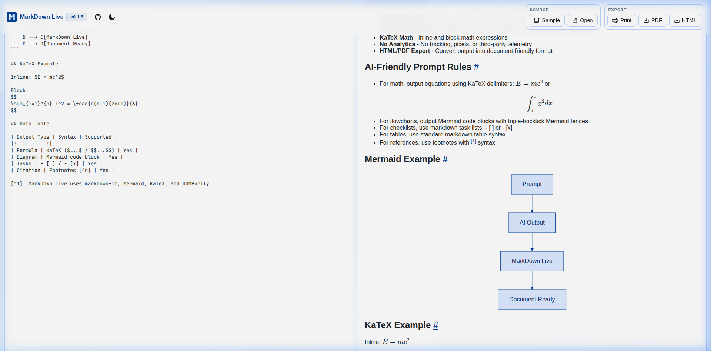
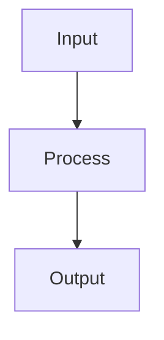

<div align="center">
  
  
  <h1>MarkDown Live</h1>
  
  <p><em>Open-source tool to convert markdown and AI output into polished documents.</em></p>

[](https://github.com/wanforge/markdown-live/releases)
[](./LICENSE)
[](https://github.com/wanforge/markdown-live/actions/workflows/ci.yml)
[](https://github.com/wanforge/markdown-live/actions/workflows/codeql.yml)
[](https://github.com/wanforge/markdown-live/actions/workflows/deploy-pages.yml)

[](https://nodejs.org)
[](https://react.dev/)
[](https://vite.dev/)
[](https://eslint.org/)


</div>

---

**MarkDown Live** is a privacy-first, open-source tool designed to transform raw markdown and AI-generated content into professional, print-ready documents. It features robust support for LaTeX mathematics (KaTeX), technical diagrams (Mermaid), and advanced formatting, all with zero tracking and a lightning-fast live preview.

## Quick Start

Run the project locally:

```bash
npm install
npm run dev
```

Build and preview:

```bash
npm run build
npm run preview
```

## AI Prompt Tips (Important)

Use these prompt keywords so your AI output is fully compatible with MarkDown Live.

### 1) Math with KaTeX

**Prompt tip:** "Write formulas using KaTeX delimiters. Inline with `$ ... $` or `\( ... \)`, and block/display math with `$$ ... $$` or `\[ ... \]`."

> [!NOTE]
> **Robust Delimiters**: MarkDown Live automatically normalizes LaTeX bracket delimiters. You can use `\[ ... \]` even without a preceding blank line, and it will render correctly as display math.

**Expected output:**

```markdown
Inline: $E = mc^2$ or \( E = mc^2 \)

Block:

$$
\int_0^1 x^2 dx = \frac{1}{3}
$$

Boxed Result:
\[ \boxed{P(X \leq 4) \approx 0.2851} \]
```

### 2) Flowcharts with Mermaid

**Prompt tip:** "Generate diagrams in Mermaid fenced code blocks using \`\`\`mermaid."

**Expected output:**

````markdown

````

### 3) Tables, Tasks, and References

**Prompt tip:** "Use GFM markdown tables, task lists (`- [ ]` / `- [x]`), and footnotes (`[^1]`)."

**Expected output:**

```markdown
| Item  | Status |
| ----- | ------ |
| Draft | Done   |

- [x] Write section
- [ ] Review section

Reference text.[^1]

[^1]: Source note.
```

### 4) Document-Ready AI Output

**Prompt tip:** "Output only clean markdown, use heading hierarchy (H1-H3), avoid HTML unless needed, and keep sections print-ready."

## Architecture & Tech Stack

**Core Technologies:**
React 19 | Vite 8 | markdown-it (+ plugins) | Mermaid | KaTeX | Highlight.js | DOMPurify | html2canvas + jsPDF | react-icons

**Color System:**
Primary brand colors are extracted directly from `icon.svg`:

- **Primary:** `#003D99`
- **Accent:** `#80B3FF`
- **Neutral:** `#FFFFFF`

**Structured Directory:**

```text
markdown-live/
├── .github/workflows/      # CI, deploy, security workflows
├── public/                 # Static assets (icon.svg, icon.png)
├── src/
│   ├── components/         # UI components (Editor, Preview, Toolbar)
│   ├── lib/                # Markdown rendering engine (markdown.js)
│   ├── styles/             # Application styles (app.css)
│   ├── utils/              # Exporters, constants, and sample markdown
│   ├── App.jsx             # Main application shell
│   └── main.jsx            # Entry point
├── eslint.config.js        # Linting configuration
├── index.html              # HTML template
├── package.json            # Project dependencies and scripts
└── vite.config.js          # Vite build configuration
```

## Development & Workflow

### GitHub Actions

- **CI:** Lint and build on `push` and `pull_request`.
- **Deploy Pages:** Auto-deploy to GitHub Pages from the `main` branch.
- **CodeQL:** Automated JavaScript security scanning.
- **Release:** Creates a GitHub release automatically when pushing a SemVer tag (`v*.*.*`).

### Release Tags

Use one of these commands to bump the version and create a tag:

```bash
npm run tag:patch  # 0.1.x
npm run tag:minor  # 0.x.0
npm run tag:major  # x.0.0
```

Then push the commit and tag to trigger the Release workflow:

```bash
git push origin main --follow-tags
```

### Changelog Policy

Changelog entries should be created from commit history (commit-first), then grouped by release version in the [CHANGELOG.md](./CHANGELOG.md) file.

## License

This project is licensed under the MIT License. See the [LICENSE](./LICENSE) file for details.

---

&copy; 2026 WanForge ([wanforge.asia](https://wanforge.asia)).
