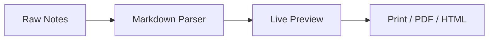
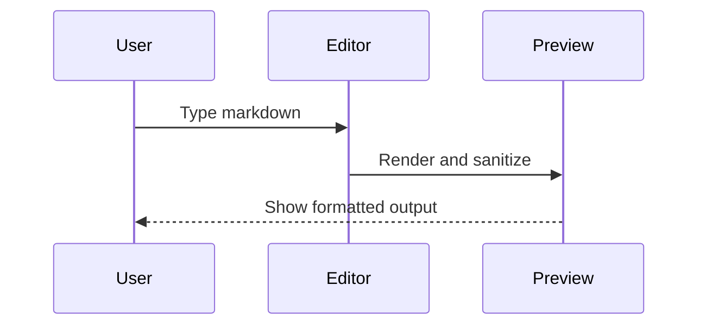

# MarkDown Live - Feature Showcase Document

This sample is bundled with the app (`public/sample.md`) and is loaded when you click **Sample** in the toolbar.

> Goal: show what the current renderer can do in one practical, export-ready document.

## Quick Intro

MarkDown Live helps you turn raw notes, AI output, and technical drafts into polished documents for web, print, PDF, or HTML export.

### What this sample demonstrates

- Heading structure (`h1` to `h3`) for automatic Table of Contents
- GFM features: tables, task list, strikethrough
- Code blocks with syntax highlighting and copy button
- KaTeX math with dollar and bracket delimiters
- Mermaid diagrams
- Footnotes and definition lists

## Editing Workflow Example

1. Write or paste markdown in the Editor pane.
2. Preview updates automatically.
3. Check TOC on the Preview side.
4. Export with Print, PDF, or HTML.

## Text Styling

Use **bold**, _italic_, **_bold+italic_**, ~~strikethrough~~, `inline code`, and ==mark/highlight==.

Subscript and superscript also work:

- Water: H~2~O
- Area formula fragment: x^2^

> Tip: keep paragraphs short so exported documents stay easy to scan.

Typographer test line: "quality" ... fast -> faster <- baseline <-> review.

## Task List

- [x] Draft technical overview
- [x] Add formulas
- [x] Add architecture diagram
- [ ] Review wording
- [ ] Export final PDF

## Tables

| Feature         | Syntax Example                | Supported |
| :-------------- | :---------------------------- | :-------: |
| Math            | `$...$`, `$$...$$`, `\(...\)` |    Yes    |
| Mermaid diagram | fenced code block `mermaid`   |    Yes    |
| Task checklist  | `- [ ]`, `- [x]`              |    Yes    |
| Footnote        | `[^id]`                       |    Yes    |
| Definition list | `Term` + `: definition`       |    Yes    |

### Alignment Example

| Left    | Center | Right |
| :------ | :----: | ----: |
| render  | stable |  99.4 |
| export  | ready  |  98.1 |
| preview | smooth |  99.0 |

## Code Blocks

```js
export function estimateReadTime(words) {
  const wpm = 225;
  return Math.max(1, Math.ceil(words / wpm));
}
```

```bash
npm install
npm run dev
npm run build
```

```json
{
  "name": "markdown-live",
  "engines": {
    "node": ">=20"
  }
}
```

## Math (KaTeX)

Inline math with dollar delimiters: $E = mc^2$.

Inline math with bracket delimiters: \(a^2 + b^2 = c^2\).

Display math:

$$
\sum_{i=1}^{n} i^2 = \frac{n(n+1)(2n+1)}{6}
$$

Bracket display delimiters are also supported:

\[
\int_0^1 x^2\,dx = \frac{1}{3}
\]

## Mermaid Diagrams





## Definition List

Markdown-it
: Core parser that converts markdown text to HTML.

DOMPurify
: Sanitizes rendered HTML to reduce XSS risk.

Mermaid
: Renders diagrams from text-based syntax.

## Quote Block

> Free Forever. No Tracking. Built Together.

## References

1. Project repository and docs are available on GitHub.[^repo]
2. Markdown renderer stack includes Mermaid and KaTeX support.[^stack]

[^repo]: https://github.com/wanforge/markdown-live

[^stack]: markdown-it, highlight.js, markdown-it-texmath (KaTeX), Mermaid, and DOMPurify.
