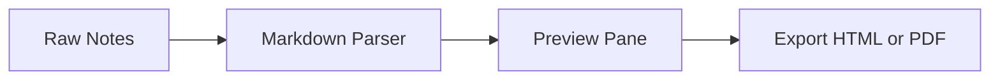
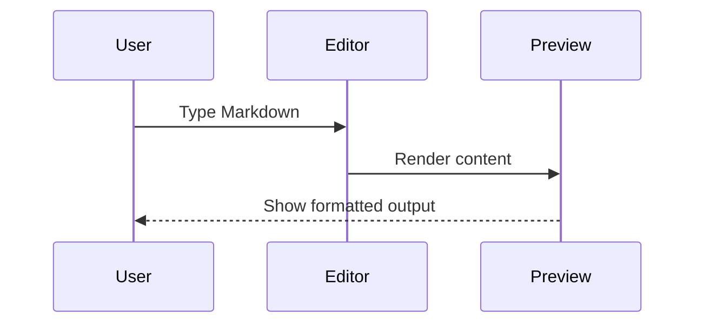

# MarkDown Live - Complete Feature Sample

> Open-source Markdown renderer. 100% free, no analytics, and built with community contributions.

**Slogan:** Free Forever. No Tracking. Built Together.

---

## Table of Contents

- [MarkDown Live - Complete Feature Sample](#markdown-live---complete-feature-sample)
  - [Table of Contents](#table-of-contents)
  - [Quick Intro](#quick-intro)
  - [Text Formatting](#text-formatting)
  - [Task List](#task-list)
  - [Tables](#tables)
    - [Alignment Example](#alignment-example)
  - [Code Blocks](#code-blocks)
  - [Math (KaTeX)](#math-katex)
  - [Mermaid Diagrams](#mermaid-diagrams)
  - [Definition List](#definition-list)
  - [References](#references)

## Quick Intro

Turn raw notes, AI output, and technical drafts into polished documentation ready to export.

- GFM support: tables, task lists, strikethrough
- Syntax highlighting with Highlight.js
- Mermaid diagram rendering
- KaTeX for inline and block formulas
- Footnotes, anchor links, and smart typography

Visit: https://github.com/wanforge/markdown-live

## Text Formatting

This paragraph demonstrates **bold**, _italic_, **_bold+italic_**, ~~strikethrough~~, `inline code`, and ==highlight==.

Water formula: H~2~O

Einstein wrote: E = mc^2^

Smart quotes and arrows via typographer: "quality" ... fast -> faster <- baseline

> Blockquote: Use this app for release notes, engineering docs, and AI-generated content cleanup.

## Task List

- [x] Write project overview
- [x] Add architecture diagram
- [ ] Final QA and review
- [ ] Export to PDF

## Tables

| Feature   | Syntax Example           | Status |
| :-------- | :----------------------- | :----: |
| Formula   | `$E = mc^2$` / `$$...$$` |  Yes   |
| Diagram   | `mermaid ... `           |  Yes   |
| Checklist | `- [ ]` / `- [x]`        |  Yes   |
| Footnote  | `[^1]`                   |  Yes   |

### Alignment Example

| Left    | Center | Right |
| :------ | :----: | ----: |
| docs    | stable |  99.9 |
| preview |  good  |  98.4 |

## Code Blocks

```js
export function estimateReadTime(words) {
  const wpm = 225;
  return Math.max(1, Math.ceil(words / wpm));
}
```

```bash
npm install
npm run dev
npm run build
```

```json
{
  "name": "markdown-live",
  "license": "MIT",
  "private": false
}
```

## Math (KaTeX)

Inline formula: $E = mc^2$

Summation block:

$$
\sum_{i=1}^{n} i^2 = \frac{n(n+1)(2n+1)}{6}
$$

Integral block:

$$
\int_0^1 x^2\,dx = \frac{1}{3}
$$

Alternative delimiters also work: \(a^2 + b^2 = c^2\)

## Mermaid Diagrams





## Definition List

Markdown-it
: A parser engine that converts markdown text into HTML.

DOMPurify
: Sanitizes rendered HTML to reduce XSS risk.

Mermaid
: Generates diagrams from text syntax.

## References

1. Project repository and docs are available on GitHub.[^repo]
2. Mermaid and KaTeX are integrated for technical writing workflows.[^stack]

[^repo]: https://github.com/wanforge/markdown-live

[^stack]: Current renderer stack includes markdown-it, highlight.js, Mermaid, KaTeX, and DOMPurify.
