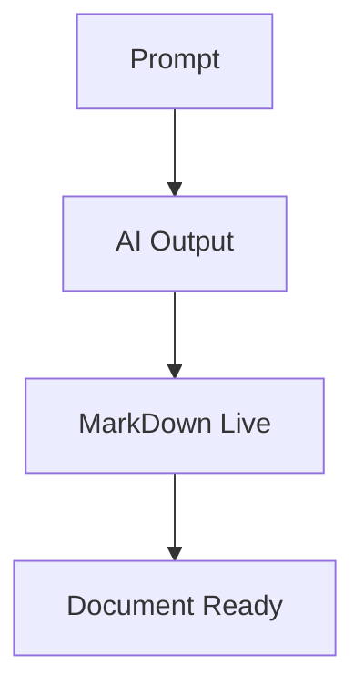

# MarkDown Live

> Open source Markdown renderer: 100% free, no fee, no analytics, and open to community contribution.

## What This Tool Does

Turn raw notes, AI output, and technical content into polished Markdown documents that are ready to print, export, and share.

## Main Slogan

**Free Forever. No Tracking. Built Together.**

## Key Features

- **Full GFM Support** - Tables, task lists, strikethrough, and more
- **Syntax Highlighting** - Highlight.js for 200+ programming languages
- **Mermaid Diagrams** - Flowcharts, sequence diagrams, and architecture diagrams
- **KaTeX Math** - Inline and block math expressions
- **No Analytics** - No tracking, pixels, or third-party telemetry
- **HTML/PDF Export** - Convert output into document-friendly format

## AI-Friendly Prompt Rules

- For math, output equations using KaTeX delimiters: $E = mc^2$ or $$\\int_0^1 x^2 dx$$
- For flowcharts, output Mermaid code blocks with triple-backtick Mermaid fences
- For checklists, use markdown task lists: - [ ] or - [x]
- For tables, use standard markdown table syntax
- For references, use footnotes with [^1] syntax

## Mermaid Example

## KaTeX Example

Inline: $E = mc^2$

Block:
$$
\\sum_{i=1}^{n} i^2 = \\frac{n(n+1)(2n+1)}{6}
$$

## Data Table

| Output Type | Syntax | Supported |
|:--|:--|:--:|
| Formula | KaTeX ($...$ / $$...$$) | Yes |
| Diagram | Mermaid code block | Yes |
| Tasks | - [ ] / - [x] | Yes |
| Citation | Footnotes [^n] | Yes |

[^1]: MarkDown Live uses markdown-it, Mermaid, KaTeX, and DOMPurify.
